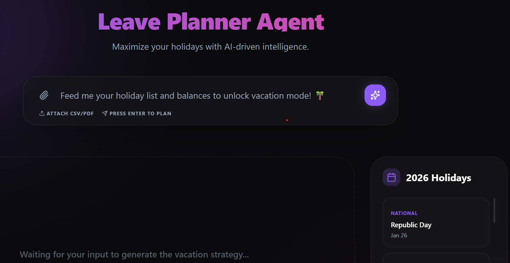

# 🌴 Leave Planner Agent

Maximize your holidays with AI-driven intelligence.



## Overview

The **Leave Planner Agent** is a sophisticated tool designed to help you optimize your vacation time. By analyzing your holiday list and leave balances, it suggests the best days to take off to maximize your rest periods with minimal leave consumption.

## Project Structure

-   `backend/`: FastAPI application handling AI reasoning, PDF/CSV parsing, and vacation strategy calculation.
-   `frontend/`: React + Vite application providing a premium, interactive user experience.

---

## 🛠 Backend Setup

The backend is built with FastAPI and uses Gemini AI for reasoning.

### Prerequisites
- Python 3.9+
- Gemini API Key ([Get one here](https://aistudio.google.com/app/apikey))

### Installation
1. Navigate to the backend directory:
   ```bash
   cd backend
   ```
2. Create a virtual environment:
   ```bash
   python -m venv venv
   source venv/bin/activate  # On Windows: venv\Scripts\activate
   ```
3. Install dependencies:
   ```bash
   pip install -r requirements.txt
   ```
4. Configuration:
   Create a `.env` file in the `backend/` directory:
   ```env
   GEMINI_API_KEY=your_gemini_api_key_here
   PORT=8000
   HOST=127.0.0.1
   ```

### Running the Backend
```bash
uvicorn main:app --reload
```
The API will be available at `http://localhost:8000`.

---

## 💻 Frontend Setup

The frontend is a modern React application styled with Tailwind CSS and Framer Motion.

### Prerequisites
- Node.js (Latest LTS recommended)
- npm or yarn

### Installation
1. Navigate to the frontend directory:
   ```bash
   cd frontend
   ```
2. Install dependencies:
   ```bash
   npm install
   ```
3. Configuration:
   Create a `.env` file in the `frontend/` directory:
   ```env
   VITE_API_BASE_URL=http://localhost:8000
   ```

### Running the Frontend
```bash
npm run dev
```
The application will be available at `http://localhost:5173`.

---

## 🚀 Technologies Used

-   **Frontend**: React, Vite, Tailwind CSS, Framer Motion, Lucide React.
-   **Backend**: FastAPI, Python, Google Generative AI (Gemini), Pandas, PyMuPDF.
-   **Intelligence**: Directed AI reasoning for vacation optimization and OCR for document parsing.

---

## License
MIT
